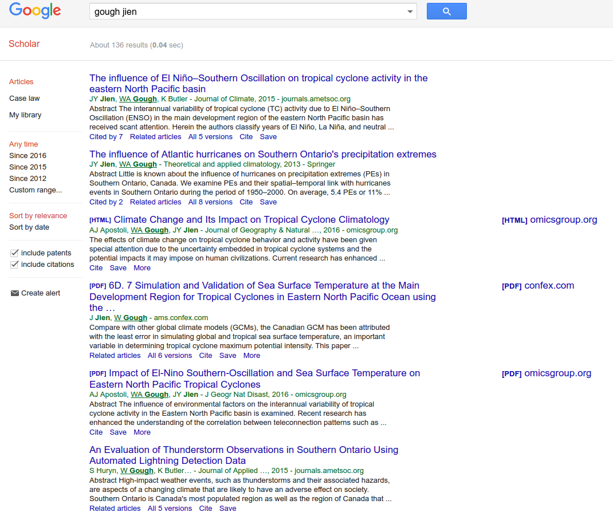

```{r setup, include=FALSE}
knitr::opts_chunk$set(echo = TRUE)
```

# Introduction

One of the principal assets of science is *reproducibility*: when you
write a paper, or read one, you or anyone else should be able to
reproduce what was done from the description given. In particular, if
you have the same data as the original authors, you should be able to
run the same analysis as they did, and get identical results. A
different form of reproducibility is that of the *conclusions*: if the
science stands up, you should be able to collect your own data, run
the same analysis on your data, and get similar conclusions to the
original authors (or be able to explain why not). 

A similar issue involves making things reproducible *for yourself*: can you re-run your original analysis using updated data, or tweak things to consider some other factor, all the while leaving everything else the same?

The traditional way of writing a paper consists of grabbing the output you need from R Studio, and copying-and-pasting it into a Word document. But this is not reproducible: if anything changes, you have to find your code, re-run it (hoping you have the right code), and copy-paste again (hoping that you remembered to copy the right thing). The whole process is fraught with potential problems, and is itself *unscientific*. We can do much better.

In this Github repository, you will see all my files, including the output and the source. Have them open side by side, so you can see how to make a certain effect happen.

# R Markdown

R Markdown is a "markup language": when you write your paper, you include not only the text, but also instructions for formatting that text, and then you process the R Markdown to obtain your formatted text. To make changes to how the formatted text appears, you go back and change the R Markdown and then process it again. This is unlike working in Word, where you see as you type what it will look like. 

In R Studio, select File, New File and R Markdown. You can start a new project, or go to the one that has your data in it.
This opens a template file that shows you some of the things you can do. (You can delete this file when you are done looking at it.) The top four or so lines, in between \texttt{---}, are called a YAML header. In your new document, this will show simple "meta-information" about the document like the author, title and date. We will see later that this is also where information about references goes. 

You can choose an output format (which you can change later). HTML is good while you're writing, since is the quickest to re-run if you make changes. If you want PDF output, you will need to have \LaTeX\ installed. Word output is probably best when you are basically happy with what you have and you're almost done.

The first thing you will want is to start a new section (called something like "Introduction"). Put the section heading on a line by itself (I like to leave blank lines before and after), and start the line with a `#`. To add a subsection, start the line with two of them, `##`. Should you wish to have a subsection of a subsection, start with three. 

You may want to have some text in italics. To do that, surround the text with asterisks, *like this*. For bold, use two asterisks  before and after, **in this fashion**.

Other things you might want to do are to link to another document, which you do by putting the link text in square brackets and following it immediately (no spaces) with the URL in brackets. You can include an image by the same sort of mechanism; for example the file `image.png` is included like this: ``. To include a mathematical formula, set it up as a LaTeX formula, and include as `$x^2+y^2$`, which comes out looking like $x^2+y^2$.

See the cheatsheet at @RMarkCS, which includes these ideas and more.

# Producing the output document

At the top of the R Studio window in which you are composing your document, you will see a ball of wool, the word "Knit", and the document format you chose. Click this to produce the latest version of your document  in your chosen format. When the document has finished processing, a previewer (HTML) or PDF viewer (PDF) or Word (.docx) will open with the processed version of your document. Review this for errors, or for changes that you want to make.

Remember, though, that the output document is the *final* stage of the chain. Make any actual changes in the `.Rmd` R Markdown document, and to see their effect, Knit the document again. 

To change the output format, click the down-arrow to the right of Knit. This will display your choices. For me, this is HTML, PDF or Word. If you change it, you'll see that the Output: line in the YAML block at the top of your document has changed along with it. The  best output format when you are writing your paper is HTML, since this is the quickest to (re-)process when you make changes to the R Markdown. You can produce a Word document, but do it *only at the end*, since that is the slowest to process (it has to open Word to show you what it has produced, and you have to close the Word document before you can process the R Markdown again). 


# Code and Code Chunks

## Introduction

Perhaps the best feature of R Markdown is that you can include code in
	your document, and *the code will be run and the results
	inserted in your document*. This means the end of copying and
	pasting results to your paper. By way of example, let's create
	a small data frame and run a regression. To insert a code
	chunk, look for the green C icon with an arrow, to the left of
	Run at the top of your Markdown document. Click it (or type
	Control-Shift-I). This will insert an empty code chunk at the
	cursor. In the code chunk, place any R code you like, such as: 

```{r}
x=1:6
y=c(10,11,14,15,15,17)
d=data.frame(x,y)
d
```

In the output, as you see, the value of the data frame `d` is shown.

Including graphs in output is no different than including text
	  results, as we see: 


```{r}
library(ggplot2)
ggplot(d,aes(x=x,y=y))+geom_point()
```

or we can do a regression:

```{r}
y.1=lm(y~x,data=d)
summary(y.1)
```

## Including only some values from the output in text

A reference for these ideas is @xie16.

We may not need all that output; we may need only a couple of values from it. First, we figure out the values we need:

```{r}
v=coef(y.1)
v
```

and then we include them in text using "backticks" (the symbol on the key below Esc on your keyboard) with \verb=r= and then an expression inside:

The intercept of the regression line is `r v[1]` and the slope is `r v[2]`.

This is better than copying the numbers into the text (for the same reason that calculating everything is better than copying and pasting: no possibility of error), because what if the intercept and slope change (perhaps because the data change) and we forget to change the text?

I might have wanted the P-value of the slope, rounded to 4 decimal places. First, I have to find out where it will be in \texttt{y.1}: it was actually in the `summary`:

```{r}
names(summary(y.1))
summary(y.1)$coefficients
```

That's the table that was in the output, and has the P-values in it. The one we want is in the second row and 4th column, so we need to do something like this:

The slope is significantly different from zero, with a P-value of `r round(summary(y.1)$coefficients[2,4],4)`.

That is a bit unwieldy, so you can create a code chunk to calculate what you want to display first:

```{r}
slope.pval=round(summary(y.1)$coefficients[2,4],4)
```
(we see in a moment how to hide this), and then say that the P-value is `r slope.pval`. (You will definitely want to be looking at the R Markdown and the output at the same time here, or else you stand to get *very* confused.)

## Displaying, or not, the code and the output

The default is to display both the code and the output, with the output displayed in "typewriter" font. This may not be what you need. In a paper, there is probably no need to display the code, and some of the output might need to be calculated but not shown. Or you might want to display some code and talk about it, but not actually run it.

To not display the code, the magic word is `echo`. You put \verb-echo=F- *inside the curly brackets at the top of the code chunk, after the `r`*: `{r, echo=F}`. To see the effect, compare these two code chunks (and go back to the source code to see how they were produced):

```{r}
d
```

with

```{r,echo=F}
d
```

In the second chunk, the code `d` (to say what to print) does not appear.

To say not to evaluate a code chunk, the key word is `eval`. You might, for example, want to display some code without running it. I do not have a variable called `xx`:

```{r,error=T}
xx
```

I might appear to be creating one here (but look at the R Markdown file):

```{r,eval=F}
xx=1:5
```

Does it exist?

```{r,error=TRUE}
xx
```

It doesn't, because the previous chunk had `eval=F` on it. If you looked at the R Markdown, you will see also that the chunks where I tried to display `xx` had an extra option `error=T` on them; this is to display the errors and keep on processing. Otherwise, when you try to Knit the file, it will stop at these errors. This is normally what you want: if there is an error, you want to fix it, not display it!

To control the output, use the option `results`. There are several possibilities here, but the most useful one for you is `'hide'`, which, as it suggests, does not display the output (though it does evaluate the code). Check the R Markdown to see what happened here:

```{r,results='hide',echo=F}
y.2=lm(y~x+I(x^2),data=d)
summary(y.2)
```

```{r}
coef(y.2)
```

The first chunk (in the R Markdown) displays neither the output nor
    the code (thus it does not appear at all in the output). The
    second chunk displays the intercept and slopes (for $x$ and
    $x^2$), but if you look only at the output it appears to have come
    from nowhere! 

When you're writing  a paper, you might want to start by displaying
     everything, so that you can follow the logic, and only when
     you're convinced it's correct do you start hiding any of it, so
     that the final paper contains only the relevant results and not
     any of the code. 

Another thing you might want to do with output is to make it look nicer.
You have a couple of choices here. The simplest is `kable` from the
    `knitr` package. Feed this a data frame, such as the one `d` that
    we made earlier:

```{r}
library(knitr)
kable(d)
```

or the table of regression slopes and P-values:

```{r}
kable(summary(y.1)$coefficients)
```

`kable` will also take an option "digits" that gives a number of
	decimal places to use for each entry in the data frame:

```{r}
kable(summary(y.1)$coefficients,digits=4)
```


`kable` is simple by design. In HTML (but not the other output formats) its tables seem to fill the width of the page
The next step up in complexity is
	`pander`, which is intelligent enough to print the output of a
	regression, or a data frame, or whatever you feed it:

```{r}
library(pander)
pander(y.1)
pander(y.2)
pander(d)
```

`pander` has a large number of options for customizing the output. But
	 it tries to do something intelligent in any case. 	 

If you wish to venture beyond this, you can investigate `xtable` as
   well. But these two should take care of most of your needs. I got
   most of this from @broman16. See also @humburg14.

In a paper, you probably want to number and refer to figures and
   tables. This doesn't seem to happen naturally in R Markdown; there
   is a mechanism called `bookdown` [@xie16b] that incorporates these ideas. I talk about this later. In `bookdown`, you will probably want to use `kable` for your tables, since the mechanism for numbering and referencing those tables is built in.


# Citations and references


  One of the fundamental things in academic work is referencing the
  work of others who came before you, as the answer to the question
  "How do I know?". There are actually two parts to referencing: there
  is the **citation** in the text, which is a piece of text of the
  form "Butler (2016)", and there is a **reference**, which is in the
  list of references at the end, which enables the reader to translate
  a citation into something that can actually be found (online or in a
  library), such as "Butler, K. (2016) Something really quite
  interesting, *Journal of Interesting Things* 24 (9) 360--361".

  The way to arrange this in R Markdown is to start with the
  reference. This needs to live in a file with extension `.bib` (in
  "BibTeX format", which is one standard way of collecting
  bibliographic information). My entry for my own (fake) article looks
  like this:

```
@article{butler16,
date={2016},
title={Something really quite interesting},
journal={Journal of Interesting Things},
volume={24},
number={9},
pages={360--361}
}
```

One way of citing websites is like this (when you know the name of the
    person writing the web page). You might know the date when the web
    page was written; if not, leave out the `date`:

```
@misc{humburg14,
date={2014},
title={Using knitr and pandoc to create reproducible reports},
author={Peter Humburg},
howpublished={\url{http://galahad.well.ox.ac.uk/repro/}},
note={Accessed: 2016-09-01}
}
```

The first line says what kind of thing it is you are citing: an
    `article` in a journal or a miscellaneous thing like a website or
    a `book`. Then an open curly bracket and then a "key", with a
    comma after it. The key is what you use to cite the item. After
    that come some lines that identify the whatever-it-is: the URL of
    a web page, the name of the author, the date a web page or article
    was published, the journal name, the volume (typically year) and
    number (which issue in a year) and page numbers. Each of these
    lines begins with what-it-is, an equals, the value inside curly
    brackets, and a comma to end the line. The last line has no comma,
    and after that a curly bracket by itself to balance the one at the
    beginning.

A BibTeX file has a list of these entries one after the other, as
    many as you like (in no particular order). See @bibtex for how to
    specify different kinds of citeable items, and keep reading to find out how to obtain this information without having to type it. 

Then go back to the YAML front matter of your R Markdown document,
    and add a line like

```
bibliography: myrefs.bib
```

where `myrefs.bib` is the name of your BibTeX file.

Now that you have the reference for each item that you wish to
      make a citation for, you can cite them in your R Markdown
      document. This is done by an at-sign followed by the key of the
      item you wish to cite (as it appears in the `.bib` file), as:
      see @butler16, or it is believed that some things are really
      quite interesting [@butler16]. You ought to be looking at my R Markdown file and the output side by side to see how this happened. See @markcite for more details.

Finally, add an empty section to the end of your document called
      References or Bibliography or similar. This will be completed
      with references for the list of items you have cited. This seems
      to be hard-coded to go at the end, which isn't helpful if your
      journal requires your figures and tables to go at the end, or
      if you want to add an Appendix (which, in many journals, goes
      after the References). I would worry about this only after you have the final paper written (the one that will go to the journal), when it's OK to do a little copying and pasting.
      There can be other items in your `.bib` file, but if they're not cited, they won't go into the references. (Unless you want them to, which you can make happen.)
      
Where does that BibTeX information come from? You can type it yourself, which is tedious. Or you can use Google Scholar. Go to `scholar.google.ca` and type an author or title into the search box. I entered `gough jien`, hoping to turn up something I knew, and I got this:



Strangely enough, I do know a fair few of those papers! I'm not sure how the paper with Steven Huryn ended up there, but it somehow did.

To obtain the BibTeX reference, click on Cite for the paper you want, eg. the first one:


This pops up a box with the reference in various different formats. Except that you don't want any of those. Click the BibTeX at the bottom, and you'll get this:

```
@article{jien2015influence,
  title={The influence of El Ni{\~n}o--Southern Oscillation on tropical cyclone activity in the eastern North Pacific basin},
  author={Jien, Jerry Y and Gough, William A and Butler, Ken},
  journal={Journal of Climate},
  volume={28},
  number={6},
  pages={2459--2474},
  year={2015}
}
```

which is exactly what needs to go in your `.bib` file. Copy and paste it. Well, almost exactly. That "key", `jien2015influence`, you might consider to be a bit long. You can change it to whatever you like: my preference is something like `jien15`. Then you have to remember to refer to the paper as `@jien15` or whatever throughout *your* paper.  See @jien15 to learn all about tropical cyclone activity in the eastern north Pacific. (This paper has a special character in its title, the n-tilde that comes from Spanish, but that makes its way into the BibTeX file properly.)

An easier way of citing websites and online content is via Greycite. Go to `http://greycite.knowledgeblog.org/`. Copy a URL into the box at the top, such as `http://www.scoresway.com/?sport=soccer&page=home`. You may or may not need to click the Search button. Then click one of the BibTeX buttons. It doesn't seem to matter which one. The BibTeX reference comes out (all on one line), which you can copy and paste into your `.bib` file. The reference is more or less the same as the ones I hand-made before. Again, the key may not be something you like; if so, change it in your `.bib` file. Now I can say: for up-to-date soccer scores, see @scoresway16 and it will appear in the list of references. In my `.bib` file, I had to tidy up the reference so that it looked nice (and I changed the key), thus:

```
@MISC{scoresway16, 
url = {http://www.scoresway.com/?sport=soccer&page=home}, 
title = {Soccer - Scoresway - Results, fixtures, tables and statistics}, 
YEAR = {2016}, 
howpublished = {\url{http://www.scoresway.com/?sport=soccer&page=home}}, 
archived = {http://greycite.knowledgeblog.org/?uri=http%3A%2F%2Fwww.scoresway.com%2F%3Fsport%3Dsoccer%26page%3Dhome}, 
}
```

If you know the author, you can add an "author" field (if Greycite didn't); likewise, if the page came from a corporation, you can use the name of the corporation as the "author". For example, I was looking for the help for PROC REG in SAS (another giant piece of statistical software), and Greycite didn't give me an author, but it seemed that the SAS Institute deserved to be one, so I added it (having checked that this is what they call themselves). And now I can refer to PROC REG in SAS [@procreg16].

I just noticed that my Greycited references for websites (under the default citation style; see below) have the URL coming out twice, possibly because the URL appears in the `url` field, and also in the `howpublished` field. I ought to delete one of these each time in my `.bib` file. A little experimentation (with a different style file, see below) shows that a website should definitely have a `url` field, as Greycite produces, and does not need a `howpublished` field if it has a `url`.

Each journal has their own preferred format for references. R Markdown's default format claims to be Chicago style, though it looks more like Harvard to me. (Compare to what came out of Google Scholar.). You can change this, but you need to get hold of a `.csl` file. See @markcite (the paragraph Citation Styles). The Zotero Style Repository [@zotero] has a vast list of journals arranged by field. If you hover over a journal, you'll see a list of things referred to in that journal's style. Click a journal to download the `.csl` file for that journal, and move the `.csl` file to the folder where your paper is (or save it there in the first place). Then, go to the YAML block at the top of your paper, where you have something like `bibliography: myrefs.bib`, and add a line below it like

```
csl: american-meteorological-society.csl
```

or whatever the `.csl` file is called for your journal. Re-`knit` your document and note that the References section now looks appropriate for the journal. Note that we didn't have to change the `.bib` file at all: that is citation-style-agnostic. What the `.csl` file does is to say how to pull things out of the `.bib` file and format them in the appropriate way (so you don't have to). Thus, a `.bib` file is a good place to keep all your references, or you can have a separate `.bib` file for each paper, so that your thesis will use several `.bib` files. There is a way of using several `.bib` files in an R Markdown document.


# Numbering and cross-referencing figures and tables

R Markdown does not number (or allow you to cross-reference) figures and tables. This is not a problem, because a parallel package `bookdown` *does* allow you to do this, and we will see how. 

The package `bookdown` [@xie16b] is a development of R Markdown that is intended for books: that is, multi-chapter documents (such as theses). Some of the things in it, such as cross-referencing figures and tables, can be "borrowed" for use in single-item documents such as journal articles. So first, you need to install `bookdown`, once, the usual way via `install.packages`. 

Up at the top of your document, in the YAML block, there will be a line like

```
output: html_document
```

Change it to

```
output: bookdown::html_document2
```

The notation with the two colons means "the `html_document2` that lives in `bookdown`", and avoids your having to say `library(bookdown)` anywhere. This is the   `bookdown`   version of HTML output that allows cross-references.  Notice that "Knit HTML" next to the ball of wool has changed to just "Knit", but clicking on it will still process the document properly.

# References


