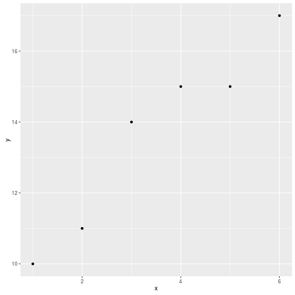

# Introduction

One of the principal assets of science is *reproducibility*: when you
write a paper, or read one, you or anyone else should be able to
reproduce what was done from the description given. In particular, if
you have the same data as the original authors, you should be able to
run the same analysis as they did, and get identical results. A
different form of reproducibility is that of the *conclusions*: if the
science stands up, you should be able to collect your own data, run
the same analysis on your data, and get similar conclusions to the
original authors (or be able to explain why not). 

A similar issue involves making things reproducible *for yourself*: can you re-run your original analysis using updated data, or tweak things to consider some other factor, all the while leaving everything else the same?

The traditional way of writing a paper consists of grabbing the output you need from R Studio, and copying-and-pasting it into a Word document. But this is not reproducible: if anything changes, you have to find your code, re-run it (hoping you have the right code), and copy-paste again (hoping that you remembered to copy the right thing). The whole process is fraught with potential problems, and is itself *unscientific*. We can do much better.

In this Github repository, you will see all my files, including the output and the source. Have them open side by side, so you can see how to make a certain effect happen.

# R Markdown

R Markdown is a "markup language": when you write your paper, you include not only the text, but also instructions for formatting that text, and then you process the R Markdown to obtain your formatted text. To make changes to how the formatted text appears, you go back and change the R Markdown and then process it again. This is unlike working in Word, where you see as you type what it will look like. 

In R Studio, select File, New File and R Markdown. You can start a new project, or go to the one that has your data in it.
This opens a template file that shows you some of the things you can do. (You can delete this file when you are done looking at it.) The top four or so lines, in between \texttt{---}, are called a YAML header. In your new document, this will show simple "meta-information" about the document like the author, title and date. We will see later that this is also where information about references goes. 

You can choose an output format (which you can change later). HTML is good while you're writing, since is the quickest to re-run if you make changes. If you want PDF output, you will need to have \LaTeX\ installed. Word output is probably best when you are basically happy with what you have and you're almost done.

The first thing you will want is to start a new section (called something like "Introduction"). Put the section heading on a line by itself (I like to leave blank lines before and after), and start the line with a \verb+#+. To add a subsection, start the line with two of them, \verb+##+. Should you wish to have a subsection of a subsection, start with three. 

You may want to have some text in italics. To do that, surround the text with asterisks, *like this*. For bold, use two asterisks  before and after, **in this fashion**.

Other things you might want to do are to link to another document, which you do by putting the link text in square brackets and following it immediately (no spaces) with the URL in brackets. You can include an image by the same sort of mechanism; for example the file `image.png` is included like this: \verb++. To include a mathematical formula, set it up as a \LaTeX\ formula, and include as \verb=$x^2+y^2$=, which looks like $x^2+y^2$.

See the cheatsheet at @RMarkCS, which includes these ideas and more.

# Producing the output document

At the top of the R Studio window in which you are composing your document, you will see a ball of wool, the word "Knit", and the document format you chose. Click this to produce the latest version of your document  in your chosen format. When the document has finished processing, a previewer (HTML) or PDF viewer (PDF) or Word (.docx) will open with the processed version of your document. Review this for errors, or for changes that you want to make.

Remember, though, that the output document is the *final* stage of the chain. Make any actual changes in the `.Rmd` R Markdown document, and to see their effect, Knit the document again. 

To change the output format, click the down-arrow to the right of Knit. This will display your choices. For me, this is HTML, PDF or Word. If you change it, you'll see that the Output: line in the YAML block at the top of your document has changed along with it.


# Code and Code Chunks

## Introduction

Perhaps the best feature of R Markdown is that you can include code in your document, and *the code will be run and the results inserted in your document*. This means the end of copying and pasting results to your paper. By way of example, let's create a small data frame and run a regression. To insert a code chunk, look for the green C icon with an arrow, to the left of Run at the top of your Markdown document. Click it (or type Control-Shift-I). This will insert an empty code chunk at the cursor. In the code chunk, place any R code you like, such as:


```r
x=1:6
y=c(10,11,14,15,15,17)
d=data.frame(x,y)
d
```

```
##   x  y
## 1 1 10
## 2 2 11
## 3 3 14
## 4 4 15
## 5 5 15
## 6 6 17
```

In the output, as you see, the value of the data frame `d` is shown.

Including graphs in output is no different than including text results, as we see:


```r
library(ggplot2)
ggplot(d,aes(x=x,y=y))+geom_point()
```



or we can do a regression:


```r
y.1=lm(y~x,data=d)
summary(y.1)
```

```
## 
## Call:
## lm(formula = y ~ x, data = d)
## 
## Residuals:
##        1        2        3        4        5        6 
## -0.23810 -0.60952  1.01905  0.64762 -0.72381 -0.09524 
## 
## Coefficients:
##             Estimate Std. Error t value Pr(>|t|)    
## (Intercept)   8.8667     0.7240  12.247 0.000255 ***
## x             1.3714     0.1859   7.377 0.001799 ** 
## ---
## Signif. codes:  0 '***' 0.001 '**' 0.01 '*' 0.05 '.' 0.1 ' ' 1
## 
## Residual standard error: 0.7777 on 4 degrees of freedom
## Multiple R-squared:  0.9315,	Adjusted R-squared:  0.9144 
## F-statistic: 54.43 on 1 and 4 DF,  p-value: 0.001799
```

## Including only some values from the output in text

A reference for these ideas is @xie16.

We may not need all that output; we may need only a couple of values from it. First, we figure out the values we need:


```r
v=coef(y.1)
v
```

```
## (Intercept)           x 
##    8.866667    1.371429
```

and then we include them in text using "backticks" (the symbol on the key below Esc on your keyboard) with \verb=r= and then an expression inside:

The intercept of the regression line is 8.8666667 and the slope is 1.3714286.

This is better than copying the numbers into the text (for the same reason that calculating everything is better than copying and pasting: no possibility of error), because what if the intercept and slope change (perhaps because the data change) and we forget to change the text?

I might have wanted the P-value of the slope, rounded to 4 decimal places. First, I have to find out where it will be in \texttt{y.1}: it was actually in the `summary`:


```r
names(summary(y.1))
```

```
##  [1] "call"          "terms"         "residuals"     "coefficients" 
##  [5] "aliased"       "sigma"         "df"            "r.squared"    
##  [9] "adj.r.squared" "fstatistic"    "cov.unscaled"
```

```r
summary(y.1)$coefficients
```

```
##             Estimate Std. Error   t value     Pr(>|t|)
## (Intercept) 8.866667  0.7239661 12.247350 0.0002552248
## x           1.371429  0.1858973  7.377343 0.0017994572
```

That's the table that was in the output, and has the P-values in it. The one we want is in the second row and 4th column, so we need to do something like this:

The slope is significantly different from zero, with a P-value of 0.0018.

That is a bit unwieldy, so you can create a code chunk to calculate what you want to display first:


```r
slope.pval=round(summary(y.1)$coefficients[2,4],4)
```
(we see in a moment how to hide this), and then say that the P-value is 0.0018.

## Displaying, or not, the code and the output

The default is to display both the code and the output, with the output displayed in "typewriter" font. This may not be what you need. In a paper, there is probably no need to display the code, and some of the output might need to be calculated but not shown. Or you might want to display some code and talk about it, but not actually run it.

To not display the code, the magic word is `echo`. You put \verb-echo=F- *inside the curly brackets at the top of the code chunk, after the `r`*: `{r, echo=F}`. To see the effect, compare these two code chunks (and go back to the source code to see how they were produced):


```r
d
```

```
##   x  y
## 1 1 10
## 2 2 11
## 3 3 14
## 4 4 15
## 5 5 15
## 6 6 17
```

with


```
##   x  y
## 1 1 10
## 2 2 11
## 3 3 14
## 4 4 15
## 5 5 15
## 6 6 17
```

In the second chunk, the code `d` (to say what to print) does not appear.

To say not to evaluate a code chunk, the key word is `eval`. You might, for example, want to display some code without running it. I do not have a variable called `xx`:


```r
xx
```

```
## Error in eval(expr, envir, enclos): object 'xx' not found
```

I might appear to be creating one here (but look at the R Markdown file):


```r
xx=1:5
```

Does it exist?


```r
xx
```

```
## Error in eval(expr, envir, enclos): object 'xx' not found
```

It doesn't, because the previous chunk had `eval=F` on it. If you looked at the R Markdown, you will see also that the chunks where I tried to display `xx` had an extra option `error=T` on them; this is to display the errors. Otherwise, when you try to Knit the file, it will stop at these errors. This is normally what you want: if there is an error, you want to fix it, not display it!

To control the output, use the option `results`. There are several possibilities here, but the most useful one for you is `'hide'`, which, as it suggests, does not display the output (though it does evaluate the code). Check the R Markdown to see what happened here:


```r
coef(y.2)
```

```
## (Intercept)           x      I(x^2) 
##    7.700000    2.246429   -0.125000
```

The first chunk (in the R Markdown) displays neither the output nor the code (thus it does not appear at all in the output). The second chunk displays the intercept and slopes (for $x$ and $x^2$), but if you look only at the output it appears to have come from nowhere!

When you're writing  a paper, you might want to start by displaying everything, so that you can follow the logic, and only when you're convinced it's correct do you start hiding any of it, so that the final paper contains only the relevant results and not any of the code.

Another thing you might want to do with output is to make it look nicer.


# Citations and references

# References
